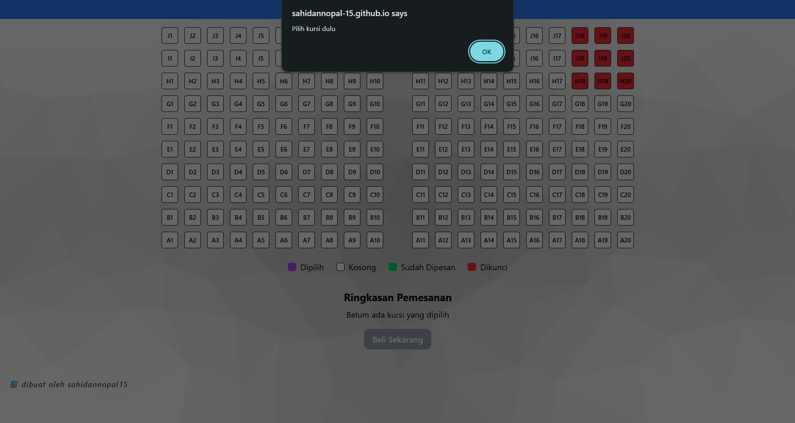
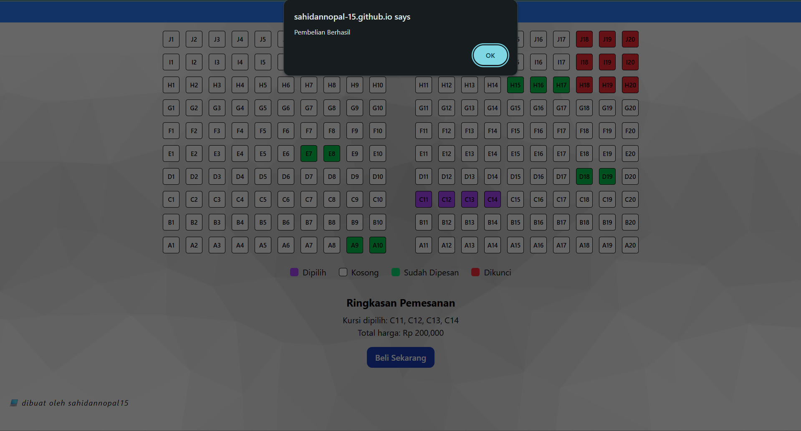
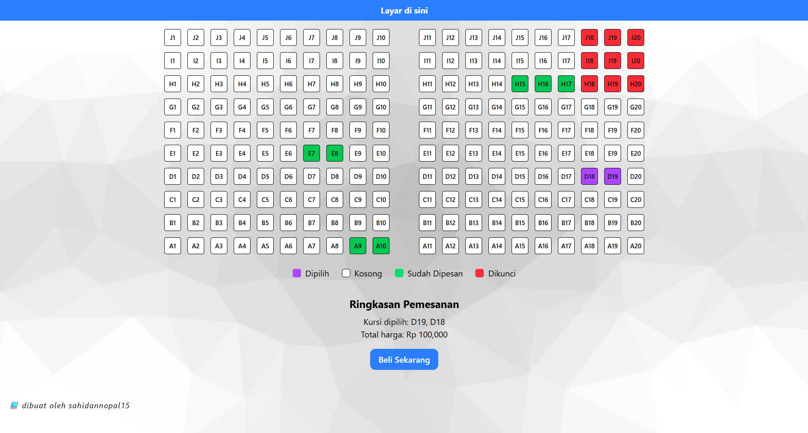

🎟️ Ticket Booking App

Aplikasi pemesanan tiket sederhana berbasis React + Tailwind CSS yang dibuat untuk mensimulasikan sistem kasir bioskop.

✨ Fitur Utama : 

🎫 Pemilihan Kursi — memilih kursi secara interaktif.

🔒 Kursi Terkunci — beberapa kursi tidak bisa dipilih karena sudah dikunci.

✅ Konfirmasi Pembelian — menampilkan notifikasi ketika pembelian berhasil.

💾 Penyimpanan Kursi Dipesan — kursi yang sudah dibeli akan berubah statusnya.

🖥️ Tampilan Kasir Bioskop (Desktop Friendly) — dibuat khusus untuk tampilan kasir, bukan untuk umum.

🧩 Teknologi yang Digunakan :

⚛️ React.js 

💨 Tailwind CSS

🎬 Tampilan :

🧠 Cara Kerja Singkat :

💺Setiap kursi memiliki status: kosong, dipilih, sudah dipesan dan terkunci.

🔒Kursi yang terkunci tidak bisa dipilih.

💸Setelah memilih kursi, klik "Beli Sekarang" untuk melakukan pembelian.

✅Kursi yang berhasil dibeli akan berubah warna menjadi hijau.

Terimakasih sudah membaca 😁